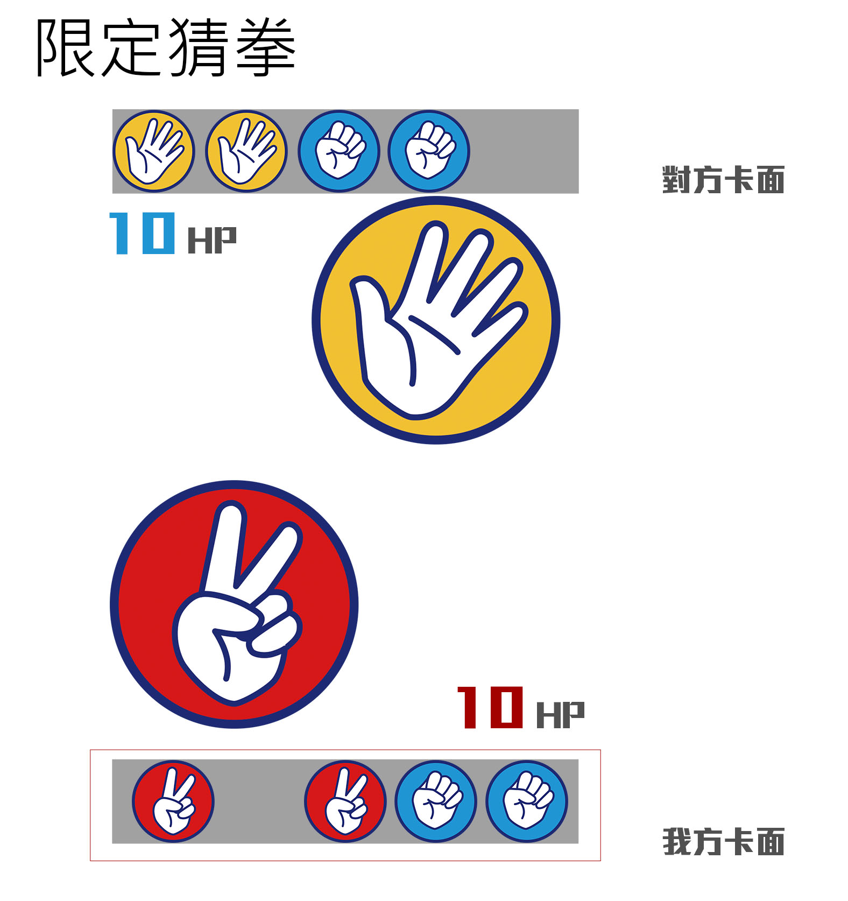

# rps-game

## how to  play

開局雙方隨機發5張牌 各有10點HP
選擇1張進行猜拳
猜拳輸的一方減去1HP
當HP為0時 則輸掉這場比賽

## 單人模式流程

### 開局
在發牌時驗證手牌是否有兩種以上的卡片
沒有的話自動重新發牌
雙方HP設定為10

### 出拳
從我方手牌選擇1張打出
進行猜拳的勝負判定後
隨機加入一張手牌
(當手上4張為同一種類的卡片時 是否重新發牌?)

### 勝負
將對方HP降為0時獲勝

### AI 模式
1. 純隨機 
2. 當單一種類卡片大於三個的時候 則選擇該項
3. 當單一種類卡片大於三個的時候 則不選擇該項
4. 玩家有一種類卡片大於三個的時候 則選擇贏過該項的卡片
5. 當玩家出牌時讀取卡片 選擇會輸給該項的卡片 (作弊模式)

